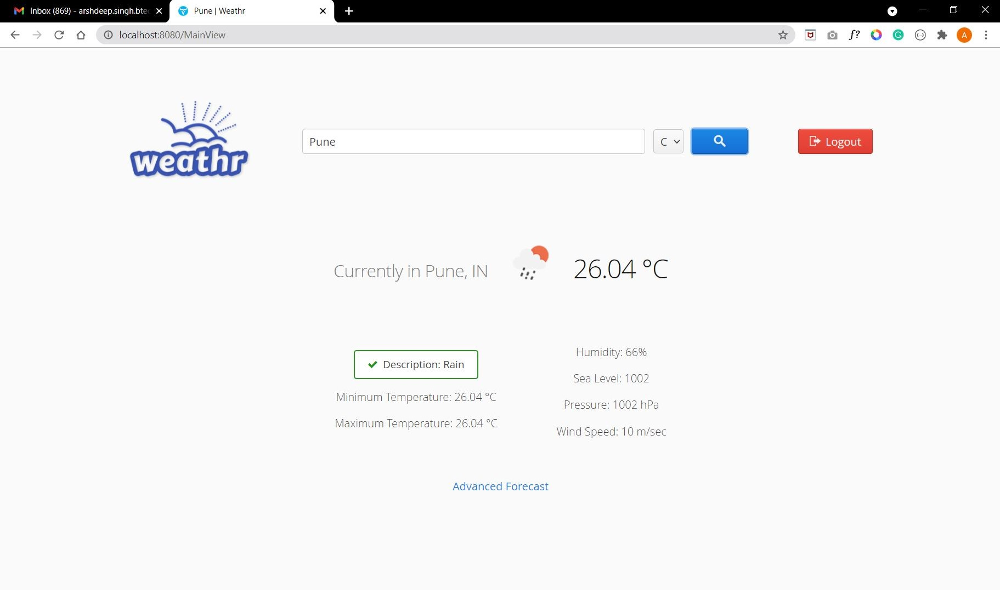

# Weathr Web App

The project is a standard Maven project, so you can import it to your IDE of choice. [Read more how to set up a development environment](https://vaadin.com/docs/v14/flow/installing/installing-overview.html) for Vaadin projects (Windows, Linux, macOS). 

This project was created from https://start.vaadin.com.

## Running and debugging the application

### Running the application from the command line.
To run from the command line, use `mvn` and open http://localhost:8080 in your browser.

### Running and debugging the application in Intellij IDEA
- Locate the Application.java class in the Project view. It is in the src folder, under the main package's root.
- Right-click on the Application class
- Select "Debug 'Application.main()'" from the list

After the application has started, you can view it at http://localhost:8080/StartView in your browser. 
You can now also attach breakpoints in code for debugging purposes, by clicking next to a line number in any source file.

Do not worry if the debugger breaks at a `SilentExitException`. This is a Spring Boot feature and happens on every startup.

## Project structure

- `views` package in `src/main/java/com/pbl/weatherapp` contains the front-end java files.
- `controller` package in `src/main/java/com/pbl/weatherapp` contains the back-end java files.

## MySQL Connection
The project uses MySQL for User Authentication. Check MySQL Documentation to setup MySQL for JDBC.
